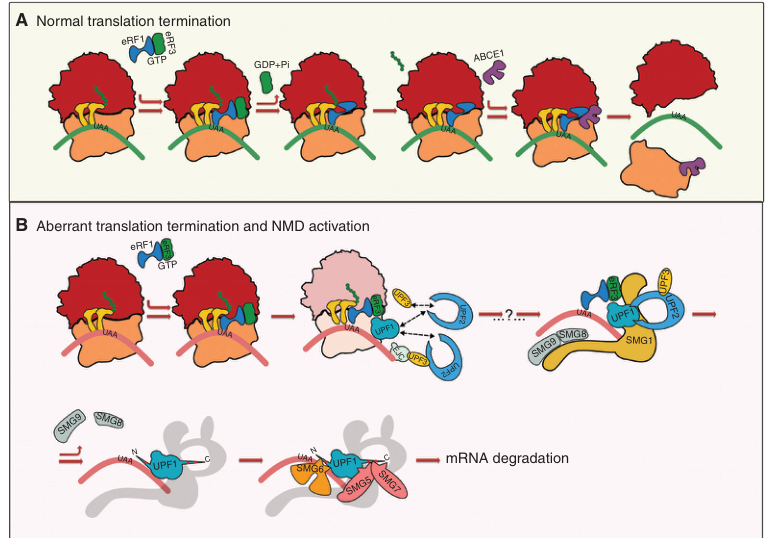

# Some Examples for Usage

This is not really an extensive usage guide but it is there to give you an idea about how to use different modules in the 
library together to get the most out of it. Here we are assuming that we have a project description that we are interested. 

I've worked on NMD (nonsense mediated mRNA decay) for my thesis work and this pathway holds a special place in my heart. 
During my thesis work, I focused on trying to find the molecular differences between normal and premature termination using
several different methods. So, for this tutorial let's assume we are doing just that. 

### Project description

This will be our project description that we will be using. 

**Project Description**

Nonsense-mediated mRNA decay (NMD) plays an important role in eukaryotic gene expression and mRNA degradataion through decapping and poly(A) shorteninig, yet the scope and the defining features of NMD-targeted transcripts remain elusive. This project aims to understand how NMD manages to differentiate between different substrates and which features of mRNAs are important for selection. Additionally we aim to understand the mechanisitic underpinnnigs of NMD as well as the factors involved in promoting mRNA degratdataion. We see to illustrate the differences between normal and premature termination both in terms of kinetic or other biochemical properties as well as any different factors involved in this differentiation if any. We plan to use in vitro, in vivo, ex vivo and in silico analysis whenever applicable to accomplish this goal

## Literature search

Like any project we will start with a literature search and collect all the information that we will need to generate a 
set of valid hypotheses and a research plan. 

We will first perform a pubmned search and then we will go over some of the papers and find ones that are relevant to our project and download and process them. 


```python
from benchmate.literature.literature import LitSearch, Paper, PaperInfo

litsearch=LitSearch()
results=litsearch.search("nonsense mediated mrna decay", database="pubmed", max_results=10_000)
len(results)
```


    3042


We got 3000+ papers, it is unlikely that these are all relevant to our project. I will get some info about these papers and then decide if they are relevant with a few lines of code. In this example I'm not going to go through all of them since that will take a bit of time, but I will go over every 60th paper to speed things up a little bit. 


```python
import time

papers=[]
for i in range(len(results)):
    if i%60==0:
        p=Paper(paper_id=paper_id, id_type="pubmed")
        p.get_abstract()
        papers.append(p)
        time.sleep(1) # I'm waiting 1 second between each query so I dont get kicked out of ncbi servers
    else:
        continue
```

Now I have collected abtracts, authors etc. for all the papers. I will then use my project description and the paper abstract to determine if these papers are relevant to what I'm interested in. Under the hood, I'm taking my project description and the paper abstract and [semantically chunking](https://medium.com/the-ai-forum/semantic-chunking-for-rag-f4733025d5f5) them then these chunks are compared to each other and the max score for each column and row is calculated. Then I just take the average of this. Before we move on let's take a look at one of the paper class instances. All the information that is related to the paper is under the `info` attribute. 


```python
p.info.abstract
```


    'Premature termination codons (PTCs) can result in the production of truncated proteins or the degradation of messenger RNAs by nonsense-mediated mRNA decay (NMD). Which of these outcomes occurs can alter the effect of a mutation, with the engagement of NMD being dependent on a series of rules. Here, by applying these rules genome-wide to obtain a resource called NMDetective, we explore the impact of NMD on genetic disease and approaches to therapy. First, human genetic diseases differ in whether NMD typically aggravates or alleviates the effects of PTCs. Second, failure to trigger NMD is a cause of ineffective gene inactivation by CRISPR-Cas9 gene editing. Finally, NMD is a determinant of the efficacy of cancer immunotherapy, with only frameshifted transcripts that escape NMD predicting a response. These results demonstrate the importance of incorporating the rules of NMD into clinical decision-making. Moreover, they suggest that inhibiting NMD may be effective in enhancing cancer immunotherapy.'


```python
p.info.title #and other things
```


    'The impact of nonsense-mediated mRNA decay on genetic disease, gene editing and cancer immunotherapy.'


```python
from benchmate.literature.paper_processor import PaperProcessor
from benchmate.config import *    
```

The models I will be using for the demo are described under `benchmate.config.py`. A good amount of trial and error went into these decisions to keep things lightweight and accurate. While you can change these if you are using the modules independenty some of the features that are being developed have values hardcoded to them. I am aware of this limtation and will be resolving them once all the features are in place. 

Let's take a `literature` section of the config


```python
literature
```


    {'vl_model': {'model': {'name': 'Qwen/Qwen2.5-VL-3B-Instruct',
       'config': {'cache_dir': '/home/alper/Documents/packages/ccm_benchmate/benchmate/models/hf_models'}},
      'processor': {'name': 'Qwen/Qwen2.5-VL-3B-Instruct',
       'config': {'cache_dir': '/home/alper/Documents/packages/ccm_benchmate/benchmate/models/hf_models'}},
      'table_prompt': 'You are an expert biologist who is responsible for reading and interpreting scientific tables. For a given table from a scientific paper interpret the table. Do not provide comments on whether the table is well done or not. Do not provide extra text on describing that you are looking at table from a scientific publication. Give an overall conclusion about what the tables tells us.',
      'figure_prompt': 'You are an expert biologist who is responsible for reading and interpreting scientific figures. For a given figure from a scientific paper interpret the figure. Do not provide comments on whether the figure is well done or not. Do not provide extra text on describing that you are looking at figure from a scientific publication. Whenever possible very briefly describe each sections of the figure and then give an overall conclusion about what the figure tells us. '},
     'lp_model': {'model_path': '/home/alper/Documents/packages/ccm_benchmate/benchmate/models/lp_model/model_final.pth',
      'config_path': '/home/alper/Documents/packages/ccm_benchmate/benchmate/models/lp_model/config.yaml'},
     'text_embedding_model': {'name': 'Qwen/Qwen3-Embedding-0.6B',
      'config': {'cache_folder': '/home/alper/Documents/packages/ccm_benchmate/benchmate/models/hf_models'}},
     'image_embedding_model': {'model': {'name': 'vidore/colpali-v1.3',
       'config': {'cache_dir': '/home/alper/Documents/packages/ccm_benchmate/benchmate/models/hf_models'}},
      'processor': {'name': 'vidore/colpali-v1.3',
       'config': {'cache_dir': '/home/alper/Documents/packages/ccm_benchmate/benchmate/models/hf_models'}}},
     'chunker_model': {'model': '/home/alper/Documents/packages/ccm_benchmate/benchmate/models/m2v_model/',
      'min_sentences': 1,
      'return_type': 'texts',
      'threshold': 'auto',
      'chunk_size': 100}}


Now that we know what we are deling with we can go ahead and calucate relevances. 


```python
processor=PaperProcessor(literature)

project_description="""Nonsense-mediated mRNA decay (NMD) plays an important role in eukaryotic gene expression and mRNA degradataion through decapping and poly(A) shorteninig, yet the scope and the defining features of NMD-targeted transcripts remain elusive. This project aims to understand how NMD manages to differentiate between different substrates and which features of mRNAs are important for selection. Additionally we aim to understand the mechanisitic underpinnnigs of NMD as well as the factors involved in promoting mRNA degratdataion. We see to illustrate the differences between normal and premature termination both in terms of kinetic or other biochemical properties as well as any different factors involved in this differentiation if any. We plan to use in vitro, in vivo, ex vivo and in silico analysis whenever applicable to accomplish this goal"""

```


```python
scores=processor.text_score(project_description, papers)
scores_df=pd.DataFrame({"paper_id":[p.info.id for p in papers], 
                       "paper_title":[p.info.title for p in papers], 
                       "paper_score":scores})

scores_df=scores_df.sort_values("paper_score", ascending=False)
scores_df
```

This looks good, we can see that the higher the score the more relevant the paper seems to be. From my experience scores >0.55 are generally a pretty safe bet. I will then take all those papers and I will see if they have a download link. 


```python
relevant_paper_ids=scores_df["paper_id"][scores_df["paper_score"]>0.55].tolist()
relevant_papers=[paper for paper in papers if paper.info.id in relevant_paper_ids]

for paper in tqdm(relevant_papers):
    try:
        paper.search_info()
        if paper.info.download_link is not None:
            paper.download("./papers") #Make sure this folder exisits otheriwise you will get an error
    except Exception as e:
        print(e)
```

Due to reasons beyong my control, I cannot just get all the papers. Some papers are behind paywalls and I do not have a pubmed api key from my institution that I can use. Additionally, some papers cannot be downloaded programatically even though they are open access, this is again because of 3rd part server settings. 

After all this now we can process the papers this includes a few steps you can do all of them or one of. 

1. We will extract all the text from the pdfs
2. We will chunk and embed the text as we have done with all the abstracts
3. We will extract the figures and tables as images
4. We will embed the figures and tables using a computer vision model
5. We will generate figure and table captions

The main reason for 5 is because pdfs are quirky files. You can include a lot of informatio about different parts of the document or none at all. The document will still look the same. They can be under different tag or metadata fields and this is different (or can be different) for each pdf. There is really no way to figure that out. Additionally, sometimes (this is especially true for large figures and tables) their captions can be on a different page, we are processing (again due to pdf quirks) each pdf page by page and we might not have the associated caption on the page we are woking on. 

While cumbersome, to get aroung all these limitations we are generating out figure captions from scratch. The VL model does a decent job for the most part and we have the actual caption from the extracted text anyway. 


```python
to_process=relevant_papers[0] #pubmed id 29891560 I cannot include the pdf because copyright but its open access
processed=processor.pipeline([to_process], extract=True, embed_text=False, embed_images=False, interpret_images=True, embed_iterpretations=False)
```


```python
#lets take a look at the first figure
from PIL import Image
from IPython.display import display
display(processed.info.figures[0])
```


    

    


```python
#and its caption
processed.info.figure_interpretation[0]
```




    ['**Figure A: Normal Translation Termination**\n\n- **Top Row:** The process begins with eEF1-GTP binding to the ribosome, which facilitates the release of the tRNA at the A site.\n- **Middle Row:** GDP+Pi is released, and the GTPase activity of eEF1 hydrolyzes GDP to GDP+Pi.\n- **Bottom Row:** ABCE1 (a protein involved in mRNA degradation) binds to the ribosome, marking it for degradation.\n\n**']


Not bad. If you want to get more information (and you should) there are some other methods you can run per paper. 


```python
processed.get_references() # will return a separate paper instance for each reference
processed.get_cited_by()
processed.get_related_works() #this is from openalex, I have nothing to do with it. 
```

#### Coming Soon

All this processing is not for the fun of it. We are working on creating modules that will allow you to create searchable database that you can ask questions or perform keyword searches. We will update our package with these features very soon. 

## APIs module

Papers are one source of information, another sources is public databases, we have implemented numerous public databases within benchmate you can see our documentation for more details and how to use each of these. For this demo we will just use [UniProt](https://www.uniprot.org/) for a quick query


```python
import pandas as pd
from benchmate.apis.uniprot import UniProt

uniprot=UniProt()
protein_results=uniprot.search("human nonsense mediated mrna decay, NMD", page_size=500)
protein_results=pd.DataFrame(protein_results)
protein_results
```


<div>
<style scoped>
    .dataframe tbody tr th:only-of-type {
        vertical-align: middle;
    }

    .dataframe tbody tr th {
        vertical-align: top;
    }

    .dataframe thead th {
        text-align: right;
    }
</style>
<table border="1" class="dataframe">
  <thead>
    <tr style="text-align: right;">
      <th></th>
      <th>id</th>
      <th>gene</th>
      <th>description</th>
      <th>synonyms</th>
      <th>organism</th>
    </tr>
  </thead>
  <tbody>
    <tr>
      <th>0</th>
      <td>Q9H0W8</td>
      <td>SMG9</td>
      <td>[Nonsense-mediated mRNA decay factor SMG9]</td>
      <td>[C19orf61]</td>
      <td>Homo sapiens</td>
    </tr>
    <tr>
      <th>1</th>
      <td>Q92540</td>
      <td>SMG7</td>
      <td>[Nonsense-mediated mRNA decay factor SMG7, [SM...</td>
      <td>[C1orf16, EST1C, KIAA0250]</td>
      <td>Homo sapiens</td>
    </tr>
    <tr>
      <th>2</th>
      <td>Q9UPR3</td>
      <td>SMG5</td>
      <td>[Nonsense-mediated mRNA decay factor SMG5, [ES...</td>
      <td>[EST1B, KIAA1089]</td>
      <td>Homo sapiens</td>
    </tr>
    <tr>
      <th>3</th>
      <td>Q86US8</td>
      <td>SMG6</td>
      <td>[Telomerase-binding protein EST1A, [Ever short...</td>
      <td>[C17orf31, EST1A, KIAA0732]</td>
      <td>Homo sapiens</td>
    </tr>
    <tr>
      <th>4</th>
      <td>Q8ND04</td>
      <td>SMG8</td>
      <td>[Nonsense-mediated mRNA decay factor SMG8, [Am...</td>
      <td>[ABC2, C17orf71]</td>
      <td>Homo sapiens</td>
    </tr>
    <tr>
      <th>...</th>
      <td>...</td>
      <td>...</td>
      <td>...</td>
      <td>...</td>
      <td>...</td>
    </tr>
    <tr>
      <th>659</th>
      <td>Q8IBN5</td>
      <td>None</td>
      <td>[40S ribosomal protein S5, putative]</td>
      <td>[]</td>
      <td>Plasmodium falciparum (isolate 3D7)</td>
    </tr>
    <tr>
      <th>660</th>
      <td>A0AA88KHA3</td>
      <td>None</td>
      <td>[60S ribosomal export protein NMD3]</td>
      <td>[]</td>
      <td>Naegleria lovaniensis</td>
    </tr>
    <tr>
      <th>661</th>
      <td>Q8IBJ9</td>
      <td>None</td>
      <td>[Mago nashi protein homologue, putative]</td>
      <td>[]</td>
      <td>Plasmodium falciparum (isolate 3D7)</td>
    </tr>
    <tr>
      <th>662</th>
      <td>Q8IE18</td>
      <td>None</td>
      <td>[RNA-binding protein, putative]</td>
      <td>[]</td>
      <td>Plasmodium falciparum (isolate 3D7)</td>
    </tr>
    <tr>
      <th>663</th>
      <td>A0A8I6A5Y3</td>
      <td>Ubbl1</td>
      <td>[Ubiquitin B like 2]</td>
      <td>[Ubcl1]</td>
      <td>Rattus norvegicus</td>
    </tr>
  </tbody>
</table>
<p>664 rows × 5 columns</p>
</div>


I actually know what I'm looking for, I'm interested in the Upf1 gene and it's protein product, let's get it's uniprot id and collect information about it. 


```python
goi=protein_results[protein_results["gene"]=="UPF1"]
goi
```


<div>
<style scoped>
    .dataframe tbody tr th:only-of-type {
        vertical-align: middle;
    }

    .dataframe tbody tr th {
        vertical-align: top;
    }

    .dataframe thead th {
        text-align: right;
    }
</style>
<table border="1" class="dataframe">
  <thead>
    <tr style="text-align: right;">
      <th></th>
      <th>id</th>
      <th>gene</th>
      <th>description</th>
      <th>synonyms</th>
      <th>organism</th>
    </tr>
  </thead>
  <tbody>
    <tr>
      <th>5</th>
      <td>Q92900</td>
      <td>UPF1</td>
      <td>[Regulator of nonsense transcripts 1, [ATP-dep...</td>
      <td>[KIAA0221, RENT1]</td>
      <td>Homo sapiens</td>
    </tr>
  </tbody>
</table>
</div>


```python
protein_info=uniprot.get_info("Q92900")
```

This will return a dizzying amount of information. But before we get to that, I want to show you the `ApiCall` dataclass. This is where all the information is stored and it also comes with a few neat features. 


```python
protein_info
```


    ApiCall @ 2025-11-05 14:02:50.566128 with args:('Q92900',), kwargs:{}


You can see that this has a timestamp. Since information in databases get updated, if you want to go back and re-run this query you don't have to repeat the whole process you can just do


```python
protein_info.rerun()
```


    ApiCall @ 2025-11-05 14:03:04.058575 with args:('Q92900',), kwargs:{}


You can see the different time stamps. Ok, let's take a look at what we have returned


```python
list(protein_info.results.keys()) # the api call results are stored under results. 
```


    ['id',
     'name',
     'sequence',
     'organism',
     'gene',
     'feature_types',
     'comment_types',
     'references',
     'xref_types',
     'xrefs',
     'description',
     'json',
     'secondary_accessions',
     'variation',
     'interactions',
     'mutagenesis',
     'isoforms']


There is so much info here but some of these I would like to pay a bit more attention to one of them is `xrefs` these are the 3rd party databases that uniprot queries for you and you have their ids there. Some of these databases are implemented in benchmate as well and you can take these ids and run those queires. 

The other one is the the `references` these are pubmed ids and we just looked at what you can do about those. 


```python
protein_info.results["xrefs"]
```


<div>
<style scoped>
    .dataframe tbody tr th:only-of-type {
        vertical-align: middle;
    }

    .dataframe tbody tr th {
        vertical-align: top;
    }

    .dataframe thead th {
        text-align: right;
    }
</style>
<table border="1" class="dataframe">
  <thead>
    <tr style="text-align: right;">
      <th></th>
      <th>type</th>
      <th>id</th>
      <th>properties</th>
      <th>isoform</th>
      <th>evidences</th>
    </tr>
  </thead>
  <tbody>
    <tr>
      <th>0</th>
      <td>EMBL</td>
      <td>U65533</td>
      <td>{'molecule type': 'mRNA', 'protein sequence ID...</td>
      <td>NaN</td>
      <td>NaN</td>
    </tr>
    <tr>
      <th>1</th>
      <td>EMBL</td>
      <td>U59323</td>
      <td>{'molecule type': 'mRNA', 'protein sequence ID...</td>
      <td>NaN</td>
      <td>NaN</td>
    </tr>
    <tr>
      <th>2</th>
      <td>EMBL</td>
      <td>D86988</td>
      <td>{'molecule type': 'mRNA', 'protein sequence ID...</td>
      <td>NaN</td>
      <td>NaN</td>
    </tr>
    <tr>
      <th>3</th>
      <td>EMBL</td>
      <td>AF074016</td>
      <td>{'molecule type': 'mRNA', 'protein sequence ID...</td>
      <td>NaN</td>
      <td>NaN</td>
    </tr>
    <tr>
      <th>4</th>
      <td>EMBL</td>
      <td>AC003972</td>
      <td>{'molecule type': 'Genomic_DNA', 'protein sequ...</td>
      <td>NaN</td>
      <td>NaN</td>
    </tr>
    <tr>
      <th>...</th>
      <td>...</td>
      <td>...</td>
      <td>...</td>
      <td>...</td>
      <td>...</td>
    </tr>
    <tr>
      <th>169</th>
      <td>Pfam</td>
      <td>PF04851</td>
      <td>{'match status': '1', 'entry name': 'ResIII'}</td>
      <td>NaN</td>
      <td>NaN</td>
    </tr>
    <tr>
      <th>170</th>
      <td>Pfam</td>
      <td>PF18141</td>
      <td>{'match status': '1', 'entry name': 'UPF1_1B_d...</td>
      <td>NaN</td>
      <td>NaN</td>
    </tr>
    <tr>
      <th>171</th>
      <td>Pfam</td>
      <td>PF09416</td>
      <td>{'match status': '1', 'entry name': 'UPF1_Zn_b...</td>
      <td>NaN</td>
      <td>NaN</td>
    </tr>
    <tr>
      <th>172</th>
      <td>SUPFAM</td>
      <td>SSF52540</td>
      <td>{'match status': '1', 'entry name': 'P-loop co...</td>
      <td>NaN</td>
      <td>NaN</td>
    </tr>
    <tr>
      <th>173</th>
      <td>PROSITE</td>
      <td>PS51997</td>
      <td>{'match status': '1', 'entry name': 'UPF1_CH_R...</td>
      <td>NaN</td>
      <td>NaN</td>
    </tr>
  </tbody>
</table>
<p>174 rows × 5 columns</p>
</div>


Comments and features are interesting too, but they are not as organized, you can use get `get_features`, `get_comments` methods in the uniprot class to get different things. 


```python
protein_info.results["comment_types"]
```


    {'ALTERNATIVE_PRODUCTS',
     'CATALYTIC_ACTIVITY',
     'DOMAIN',
     'FUNCTION',
     'INTERACTION',
     'PTM',
     'SEQUENCE_CAUTION',
     'SIMILARITY',
     'SUBCELLULAR_LOCATION',
     'SUBUNIT',
     'TISSUE_SPECIFICITY'}


```python
#you will need to pass and api call specific to uniprot to this
uniprot.get_comments(protein_info.results, "FUNCTION") 
```


    [{'type': 'FUNCTION',
      'text': [{'value': "RNA-dependent helicase required for nonsense-mediated decay (NMD) of aberrant mRNAs containing premature stop codons and modulates the expression level of normal mRNAs (PubMed:11163187, PubMed:16086026, PubMed:18172165, PubMed:21145460, PubMed:21419344, PubMed:24726324). Is recruited to mRNAs upon translation termination and undergoes a cycle of phosphorylation and dephosphorylation; its phosphorylation appears to be a key step in NMD (PubMed:11544179, PubMed:25220460). Recruited by release factors to stalled ribosomes together with the SMG1C protein kinase complex to form the transient SURF (SMG1-UPF1-eRF1-eRF3) complex (PubMed:19417104). In EJC-dependent NMD, the SURF complex associates with the exon junction complex (EJC) (located 50-55 or more nucleotides downstream from the termination codon) through UPF2 and allows the formation of an UPF1-UPF2-UPF3 surveillance complex which is believed to activate NMD (PubMed:21419344). Phosphorylated UPF1 is recognized by EST1B/SMG5, SMG6 and SMG7 which are thought to provide a link to the mRNA degradation machinery involving exonucleolytic and endonucleolytic pathways, and to serve as adapters to protein phosphatase 2A (PP2A), thereby triggering UPF1 dephosphorylation and allowing the recycling of NMD factors (PubMed:12554878). UPF1 can also activate NMD without UPF2 or UPF3, and in the absence of the NMD-enhancing downstream EJC indicative for alternative NMD pathways (PubMed:18447585). Plays a role in replication-dependent histone mRNA degradation at the end of phase S; the function is independent of UPF2 (PubMed:16086026, PubMed:18172165). For the recognition of premature termination codons (PTC) and initiation of NMD a competitive interaction between UPF1 and PABPC1 with the ribosome-bound release factors is proposed (PubMed:18447585, PubMed:25220460). The ATPase activity of UPF1 is required for disassembly of mRNPs undergoing NMD (PubMed:21145460). Together with UPF2 and dependent on TDRD6, mediates the degradation of mRNA harboring long 3'UTR by inducing the NMD machinery (By similarity). Also capable of unwinding double-stranded DNA and translocating on single-stranded DNA (PubMed:30218034)",
        'evidences': [{'code': 'ECO:0000250',
          'source': {'name': 'UniProtKB',
           'id': 'Q9EPU0',
           'url': 'https://www.uniprot.org/uniprot/Q9EPU0'}},
         {'code': 'ECO:0000269',
          'source': {'name': 'PubMed',
           'id': '11163187',
           'url': 'http://www.ncbi.nlm.nih.gov/pubmed/11163187',
           'alternativeUrl': 'https://europepmc.org/abstract/MED/11163187'}},
         {'code': 'ECO:0000269',
          'source': {'name': 'PubMed',
           'id': '11544179',
           'url': 'http://www.ncbi.nlm.nih.gov/pubmed/11544179',
           'alternativeUrl': 'https://europepmc.org/abstract/MED/11544179'}},
         {'code': 'ECO:0000269',
          'source': {'name': 'PubMed',
           'id': '12554878',
           'url': 'http://www.ncbi.nlm.nih.gov/pubmed/12554878',
           'alternativeUrl': 'https://europepmc.org/abstract/MED/12554878'}},
         {'code': 'ECO:0000269',
          'source': {'name': 'PubMed',
           'id': '16086026',
           'url': 'http://www.ncbi.nlm.nih.gov/pubmed/16086026',
           'alternativeUrl': 'https://europepmc.org/abstract/MED/16086026'}},
         {'code': 'ECO:0000269',
          'source': {'name': 'PubMed',
           'id': '18172165',
           'url': 'http://www.ncbi.nlm.nih.gov/pubmed/18172165',
           'alternativeUrl': 'https://europepmc.org/abstract/MED/18172165'}},
         {'code': 'ECO:0000269',
          'source': {'name': 'PubMed',
           'id': '18447585',
           'url': 'http://www.ncbi.nlm.nih.gov/pubmed/18447585',
           'alternativeUrl': 'https://europepmc.org/abstract/MED/18447585'}},
         {'code': 'ECO:0000269',
          'source': {'name': 'PubMed',
           'id': '19417104',
           'url': 'http://www.ncbi.nlm.nih.gov/pubmed/19417104',
           'alternativeUrl': 'https://europepmc.org/abstract/MED/19417104'}},
         {'code': 'ECO:0000269',
          'source': {'name': 'PubMed',
           'id': '21145460',
           'url': 'http://www.ncbi.nlm.nih.gov/pubmed/21145460',
           'alternativeUrl': 'https://europepmc.org/abstract/MED/21145460'}},
         {'code': 'ECO:0000269',
          'source': {'name': 'PubMed',
           'id': '21419344',
           'url': 'http://www.ncbi.nlm.nih.gov/pubmed/21419344',
           'alternativeUrl': 'https://europepmc.org/abstract/MED/21419344'}},
         {'code': 'ECO:0000269',
          'source': {'name': 'PubMed',
           'id': '24726324',
           'url': 'http://www.ncbi.nlm.nih.gov/pubmed/24726324',
           'alternativeUrl': 'https://europepmc.org/abstract/MED/24726324'}},
         {'code': 'ECO:0000269',
          'source': {'name': 'PubMed',
           'id': '25220460',
           'url': 'http://www.ncbi.nlm.nih.gov/pubmed/25220460',
           'alternativeUrl': 'https://europepmc.org/abstract/MED/25220460'}},
         {'code': 'ECO:0000269',
          'source': {'name': 'PubMed',
           'id': '30218034',
           'url': 'http://www.ncbi.nlm.nih.gov/pubmed/30218034',
           'alternativeUrl': 'https://europepmc.org/abstract/MED/30218034'}}]}]}]


Well, this is a protein, where is its sequence?


```python
protein_info.results["sequence"]
```


    'MSVEAYGPSSQTLTFLDTEEAELLGADTQGSEFEFTDFTLPSQTQTPPGGPGGPGGGGAGGPGGAGAGAAAGQLDAQVGPEGILQNGAVDDSVAKTSQLLAELNFEEDEEDTYYTKDLPIHACSYCGIHDPACVVYCNTSKKWFCNGRGNTSGSHIVNHLVRAKCKEVTLHKDGPLGETVLECYNCGCRNVFLLGFIPAKADSVVVLLCRQPCASQSSLKDINWDSSQWQPLIQDRCFLSWLVKIPSEQEQLRARQITAQQINKLEELWKENPSATLEDLEKPGVDEEPQHVLLRYEDAYQYQNIFGPLVKLEADYDKKLKESQTQDNITVRWDLGLNKKRIAYFTLPKTDSGNEDLVIIWLRDMRLMQGDEICLRYKGDLAPLWKGIGHVIKVPDNYGDEIAIELRSSVGAPVEVTHNFQVDFVWKSTSFDRMQSALKTFAVDETSVSGYIYHKLLGHEVEDVIIKCQLPKRFTAQGLPDLNHSQVYAVKTVLQRPLSLIQGPPGTGKTVTSATIVYHLARQGNGPVLVCAPSNIAVDQLTEKIHQTGLKVVRLCAKSREAIDSPVSFLALHNQIRNMDSMPELQKLQQLKDETGELSSADEKRYRALKRTAERELLMNADVICCTCVGAGDPRLAKMQFRSILIDESTQATEPECMVPVVLGAKQLILVGDHCQLGPVVMCKKAAKAGLSQSLFERLVVLGIRPIRLQVQYRMHPALSAFPSNIFYEGSLQNGVTAADRVKKGFDFQWPQPDKPMFFYVTQGQEEIASSGTSYLNRTEAANVEKITTKLLKAGAKPDQIGIITPYEGQRSYLVQYMQFSGSLHTKLYQEVEIASVDAFQGREKDFIILSCVRANEHQGIGFLNDPRRLNVALTRARYGVIIVGNPKALSKQPLWNHLLNYYKEQKVLVEGPLNNLRESLMQFSKPRKLVNTINPGARFMTTAMYDAREAIIPGSVYDRSSQGRPSSMYFQTHDQIGMISAGPSHVAAMNIPIPFNLVMPPMPPPGYFGQANGPAAGRGTPKGKTGRGGRQKNRFGLPGPSQTNLPNSQASQDVASQPFSQGALTQGYISMSQPSQMSQPGLSQPELSQDSYLGDEFKSQIDVALSQDSTYQGERAYQHGGVTGLSQY'


## Sequence modulde

I think this provides a good segue to the sequence module, this module has 2 main classes, `Sequence` and `SequenceList`


```python
from benchmate.sequence.sequence import Sequence, SequenceList
myseq=Sequence(name="upf1", sequence=protein_info.results["sequence"])
```

Sequence objects have quite a few different methods associated with them, you can see what they are in the documentation, here I want to demonostrate the SequenceList so I will generate a few more sequences by generateing some version of the same sequence. 


```python
myseq2=myseq.mutate(0, "T")
myseq3=myseq.delete(10, 35)
```


```python
seqlist=SequenceList([myseq, myseq2, myseq3])
seqlist.ClustalOmega()
```


    (['MSVEAYGPSSQTLTFLDTEEAELLGADTQGSEFEFTDFTLPSQTQTPPGGPGGPGGGGAGGPGGAGAGAAAGQLDAQVGPEGILQNGAVDDSVAKTSQLLAELNFEEDEEDTYYTKDLPIHACSYCGIHDPACVVYCNTSKKWFCNGRGNTSGSHIVNHLVRAKCKEVTLHKDGPLGETVLECYNCGCRNVFLLGFIPAKADSVVVLLCRQPCASQSSLKDINWDSSQWQPLIQDRCFLSWLVKIPSEQEQLRARQITAQQINKLEELWKENPSATLEDLEKPGVDEEPQHVLLRYEDAYQYQNIFGPLVKLEADYDKKLKESQTQDNITVRWDLGLNKKRIAYFTLPKTDSGNEDLVIIWLRDMRLMQGDEICLRYKGDLAPLWKGIGHVIKVPDNYGDEIAIELRSSVGAPVEVTHNFQVDFVWKSTSFDRMQSALKTFAVDETSVSGYIYHKLLGHEVEDVIIKCQLPKRFTAQGLPDLNHSQVYAVKTVLQRPLSLIQGPPGTGKTVTSATIVYHLARQGNGPVLVCAPSNIAVDQLTEKIHQTGLKVVRLCAKSREAIDSPVSFLALHNQIRNMDSMPELQKLQQLKDETGELSSADEKRYRALKRTAERELLMNADVICCTCVGAGDPRLAKMQFRSILIDESTQATEPECMVPVVLGAKQLILVGDHCQLGPVVMCKKAAKAGLSQSLFERLVVLGIRPIRLQVQYRMHPALSAFPSNIFYEGSLQNGVTAADRVKKGFDFQWPQPDKPMFFYVTQGQEEIASSGTSYLNRTEAANVEKITTKLLKAGAKPDQIGIITPYEGQRSYLVQYMQFSGSLHTKLYQEVEIASVDAFQGREKDFIILSCVRANEHQGIGFLNDPRRLNVALTRARYGVIIVGNPKALSKQPLWNHLLNYYKEQKVLVEGPLNNLRESLMQFSKPRKLVNTINPGARFMTTAMYDAREAIIPGSVYDRSSQGRPSSMYFQTHDQIGMISAGPSHVAAMNIPIPFNLVMPPMPPPGYFGQANGPAAGRGTPKGKTGRGGRQKNRFGLPGPSQTNLPNSQASQDVASQPFSQGALTQGYISMSQPSQMSQPGLSQPELSQDSYLGDEFKSQIDVALSQDSTYQGERAYQHGGVTGLSQY',
      'TSVEAYGPSSQTLTFLDTEEAELLGADTQGSEFEFTDFTLPSQTQTPPGGPGGPGGGGAGGPGGAGAGAAAGQLDAQVGPEGILQNGAVDDSVAKTSQLLAELNFEEDEEDTYYTKDLPIHACSYCGIHDPACVVYCNTSKKWFCNGRGNTSGSHIVNHLVRAKCKEVTLHKDGPLGETVLECYNCGCRNVFLLGFIPAKADSVVVLLCRQPCASQSSLKDINWDSSQWQPLIQDRCFLSWLVKIPSEQEQLRARQITAQQINKLEELWKENPSATLEDLEKPGVDEEPQHVLLRYEDAYQYQNIFGPLVKLEADYDKKLKESQTQDNITVRWDLGLNKKRIAYFTLPKTDSGNEDLVIIWLRDMRLMQGDEICLRYKGDLAPLWKGIGHVIKVPDNYGDEIAIELRSSVGAPVEVTHNFQVDFVWKSTSFDRMQSALKTFAVDETSVSGYIYHKLLGHEVEDVIIKCQLPKRFTAQGLPDLNHSQVYAVKTVLQRPLSLIQGPPGTGKTVTSATIVYHLARQGNGPVLVCAPSNIAVDQLTEKIHQTGLKVVRLCAKSREAIDSPVSFLALHNQIRNMDSMPELQKLQQLKDETGELSSADEKRYRALKRTAERELLMNADVICCTCVGAGDPRLAKMQFRSILIDESTQATEPECMVPVVLGAKQLILVGDHCQLGPVVMCKKAAKAGLSQSLFERLVVLGIRPIRLQVQYRMHPALSAFPSNIFYEGSLQNGVTAADRVKKGFDFQWPQPDKPMFFYVTQGQEEIASSGTSYLNRTEAANVEKITTKLLKAGAKPDQIGIITPYEGQRSYLVQYMQFSGSLHTKLYQEVEIASVDAFQGREKDFIILSCVRANEHQGIGFLNDPRRLNVALTRARYGVIIVGNPKALSKQPLWNHLLNYYKEQKVLVEGPLNNLRESLMQFSKPRKLVNTINPGARFMTTAMYDAREAIIPGSVYDRSSQGRPSSMYFQTHDQIGMISAGPSHVAAMNIPIPFNLVMPPMPPPGYFGQANGPAAGRGTPKGKTGRGGRQKNRFGLPGPSQTNLPNSQASQDVASQPFSQGALTQGYISMSQPSQMSQPGLSQPELSQDSYLGDEFKSQIDVALSQDSTYQGERAYQHGGVTGLSQY',
      'MSVEAYGPS-------------------------STDFTLPSQTQTPPGGPGGPGGGGAGGPGGAGAGAAAGQLDAQVGPEGILQNGAVDDSVAKTSQLLAELNFEEDEEDTYYTKDLPIHACSYCGIHDPACVVYCNTSKKWFCNGRGNTSGSHIVNHLVRAKCKEVTLHKDGPLGETVLECYNCGCRNVFLLGFIPAKADSVVVLLCRQPCASQSSLKDINWDSSQWQPLIQDRCFLSWLVKIPSEQEQLRARQITAQQINKLEELWKENPSATLEDLEKPGVDEEPQHVLLRYEDAYQYQNIFGPLVKLEADYDKKLKESQTQDNITVRWDLGLNKKRIAYFTLPKTDSGNEDLVIIWLRDMRLMQGDEICLRYKGDLAPLWKGIGHVIKVPDNYGDEIAIELRSSVGAPVEVTHNFQVDFVWKSTSFDRMQSALKTFAVDETSVSGYIYHKLLGHEVEDVIIKCQLPKRFTAQGLPDLNHSQVYAVKTVLQRPLSLIQGPPGTGKTVTSATIVYHLARQGNGPVLVCAPSNIAVDQLTEKIHQTGLKVVRLCAKSREAIDSPVSFLALHNQIRNMDSMPELQKLQQLKDETGELSSADEKRYRALKRTAERELLMNADVICCTCVGAGDPRLAKMQFRSILIDESTQATEPECMVPVVLGAKQLILVGDHCQLGPVVMCKKAAKAGLSQSLFERLVVLGIRPIRLQVQYRMHPALSAFPSNIFYEGSLQNGVTAADRVKKGFDFQWPQPDKPMFFYVTQGQEEIASSGTSYLNRTEAANVEKITTKLLKAGAKPDQIGIITPYEGQRSYLVQYMQFSGSLHTKLYQEVEIASVDAFQGREKDFIILSCVRANEHQGIGFLNDPRRLNVALTRARYGVIIVGNPKALSKQPLWNHLLNYYKEQKVLVEGPLNNLRESLMQFSKPRKLVNTINPGARFMTTAMYDAREAIIPGSVYDRSSQGRPSSMYFQTHDQIGMISAGPSHVAAMNIPIPFNLVMPPMPPPGYFGQANGPAAGRGTPKGKTGRGGRQKNRFGLPGPSQTNLPNSQASQDVASQPFSQGALTQGYISMSQPSQMSQPGLSQPELSQDSYLGDEFKSQIDVALSQDSTYQGERAYQHGGVTGLSQY'],
     array([[0.      , 0.000886, 0.009058],
            [0.000886, 0.      , 0.009058],
            [0.009058, 0.009058, 0.      ]]),
     '((0:0.0004428699903655797,1:0.0004428699903655797):0.004086120054125786,2:0.004528990015387535):0.0;')


Here I have created a sequence list instances and I have calcualted pairwise sequence alignment. You can read from a fasta (and write to it), if you have more than 1 sequence in your fasta you will get a `SequenceList` otherwise you will get a `Sequence`. 

Our protein upf1 doesn't just have sequences, it also has structures, let's see if we can find any structures in the protein_results from uniprot. 


```python
protein_info.results["xrefs"]["type"].drop_duplicates().tolist()
```


    ['EMBL',
     'CCDS',
     'RefSeq',
     'PDB',
     'PDBsum',
     'AlphaFoldDB',
     'EMDB',
     'SMR',
     'BioGRID',
     'CORUM',
     'DIP',
     'FunCoup',
     'IntAct',
     'MINT',
     'STRING',
     'GlyCosmos',
     'GlyGen',
     'iPTMnet',
     'MetOSite',
     'PhosphoSitePlus',
     'SwissPalm',
     'BioMuta',
     'DMDM',
     'jPOST',
     'MassIVE',
     'PaxDb',
     'PeptideAtlas',
     'ProteomicsDB',
     'Pumba',
     'Antibodypedia',
     'DNASU',
     'Ensembl',
     'GeneID',
     'KEGG',
     'MANE-Select',
     'UCSC',
     'AGR',
     'CTD',
     'DisGeNET',
     'GeneCards',
     'HGNC',
     'HPA',
     'MalaCards',
     'MIM',
     'neXtProt',
     'OpenTargets',
     'PharmGKB',
     'VEuPathDB',
     'eggNOG',
     'GeneTree',
     'HOGENOM',
     'InParanoid',
     'OMA',
     'OrthoDB',
     'PAN-GO',
     'PhylomeDB',
     'TreeFam',
     'BRENDA',
     'PathwayCommons',
     'Reactome',
     'SignaLink',
     'SIGNOR',
     'BioGRID-ORCS',
     'CD-CODE',
     'ChiTaRS',
     'EvolutionaryTrace',
     'GeneWiki',
     'GenomeRNAi',
     'Pharos',
     'PRO',
     'Proteomes',
     'RNAct',
     'Bgee',
     'ExpressionAtlas',
     'GO',
     'CDD',
     'FunFam',
     'Gene3D',
     'IDEAL',
     'InterPro',
     'PANTHER',
     'Pfam',
     'SUPFAM',
     'PROSITE']


I see "PDB" in the list of cross references, let's take a look. 


```python
protein_info.results["xrefs"][protein_info.results["xrefs"]["type"]=="PDB"]
```


<div>
<style scoped>
    .dataframe tbody tr th:only-of-type {
        vertical-align: middle;
    }

    .dataframe tbody tr th {
        vertical-align: top;
    }

    .dataframe thead th {
        text-align: right;
    }
</style>
<table border="1" class="dataframe">
  <thead>
    <tr style="text-align: right;">
      <th></th>
      <th>type</th>
      <th>id</th>
      <th>properties</th>
      <th>isoform</th>
      <th>evidences</th>
    </tr>
  </thead>
  <tbody>
    <tr>
      <th>10</th>
      <td>PDB</td>
      <td>2GJK</td>
      <td>{'method': 'X-ray', 'chains': 'A=295-925', 're...</td>
      <td>NaN</td>
      <td>NaN</td>
    </tr>
    <tr>
      <th>11</th>
      <td>PDB</td>
      <td>2GK6</td>
      <td>{'method': 'X-ray', 'chains': 'A/B=295-925', '...</td>
      <td>NaN</td>
      <td>NaN</td>
    </tr>
    <tr>
      <th>12</th>
      <td>PDB</td>
      <td>2GK7</td>
      <td>{'method': 'X-ray', 'chains': 'A=295-925', 're...</td>
      <td>NaN</td>
      <td>NaN</td>
    </tr>
    <tr>
      <th>13</th>
      <td>PDB</td>
      <td>2IYK</td>
      <td>{'method': 'X-ray', 'chains': 'A/B=115-272', '...</td>
      <td>NaN</td>
      <td>NaN</td>
    </tr>
    <tr>
      <th>14</th>
      <td>PDB</td>
      <td>2WJV</td>
      <td>{'method': 'X-ray', 'chains': 'A/B=115-925', '...</td>
      <td>NaN</td>
      <td>NaN</td>
    </tr>
    <tr>
      <th>15</th>
      <td>PDB</td>
      <td>2WJY</td>
      <td>{'method': 'X-ray', 'chains': 'A=115-925', 're...</td>
      <td>NaN</td>
      <td>NaN</td>
    </tr>
    <tr>
      <th>16</th>
      <td>PDB</td>
      <td>2XZO</td>
      <td>{'method': 'X-ray', 'chains': 'A=295-925', 're...</td>
      <td>NaN</td>
      <td>NaN</td>
    </tr>
    <tr>
      <th>17</th>
      <td>PDB</td>
      <td>2XZP</td>
      <td>{'method': 'X-ray', 'chains': 'A=295-925', 're...</td>
      <td>NaN</td>
      <td>NaN</td>
    </tr>
    <tr>
      <th>18</th>
      <td>PDB</td>
      <td>6EJ5</td>
      <td>{'method': 'X-ray', 'chains': 'A=295-925', 're...</td>
      <td>NaN</td>
      <td>NaN</td>
    </tr>
    <tr>
      <th>19</th>
      <td>PDB</td>
      <td>6Z3R</td>
      <td>{'method': 'EM', 'chains': 'E=1085-1095', 'res...</td>
      <td>NaN</td>
      <td>NaN</td>
    </tr>
    <tr>
      <th>20</th>
      <td>PDB</td>
      <td>8RXB</td>
      <td>{'method': 'X-ray', 'chains': 'A/D/E/I/L/P=115...</td>
      <td>NaN</td>
      <td>NaN</td>
    </tr>
  </tbody>
</table>
</div>


Oh, a lot of strucures, I see one with lot's of chains the last one, let's get that one. 


```python
from benchmate.structure.structure import Structure
my_str=Structure(name="upf1", source="PDB", id="8RXB", file=None)
```

If you have a local pdb file you can used that under file otherwise you can (like we did here) specify an id from pdb or alphafolddb to download it. We saw that the structure had a lot of chains, let's see them. 


```python
my_str.info.chains
```


    array(['E', 'F', 'A', 'B', 'D', 'G', 'I', 'J', 'L', 'N', 'P', 'Q', 'E',
           'A', 'D', 'I', 'L', 'P'], dtype='<U4')


There a many methods associated with structures, a quick example here, I'm going to calculate the contact between chains E and F


```python
contacts=my_str.contacts("E", "F")
contacts[0:10]
```


    [{'E': 818, 'F': 50, 'distance': 4.976994},
     {'E': 885, 'F': 55, 'distance': 4.9693766},
     {'E': 886, 'F': 94, 'distance': 4.873773},
     {'E': 886, 'F': 99, 'distance': 4.001063},
     {'E': 886, 'F': 101, 'distance': 4.5759163},
     {'E': 886, 'F': 103, 'distance': 4.421472},
     {'E': 887, 'F': 99, 'distance': 4.924966},
     {'E': 887, 'F': 101, 'distance': 4.9591007},
     {'E': 890, 'F': 90, 'distance': 4.9222174},
     {'E': 890, 'F': 94, 'distance': 4.6336584}]


We can see the first 10 atoms and the distances between them. You can also do some fancy indexing if you want to select things. 


```python
my_str["A"][10:30]
```


    array([
    	Atom(np.array([30.226, 17.509,  9.708], dtype=float32), chain_id="A", res_id=3, ins_code="", res_name="ASP", hetero=False, atom_name="O", element="O"),
    	Atom(np.array([28.546, 19.227,  8.242], dtype=float32), chain_id="A", res_id=3, ins_code="", res_name="ASP", hetero=False, atom_name="CB", element="C"),
    	Atom(np.array([27.528, 18.246,  7.703], dtype=float32), chain_id="A", res_id=3, ins_code="", res_name="ASP", hetero=False, atom_name="CG", element="C"),
    	Atom(np.array([26.726, 17.717,  8.501], dtype=float32), chain_id="A", res_id=3, ins_code="", res_name="ASP", hetero=False, atom_name="OD1", element="O"),
    	Atom(np.array([27.537, 18.004,  6.476], dtype=float32), chain_id="A", res_id=3, ins_code="", res_name="ASP", hetero=False, atom_name="OD2", element="O"),
    	Atom(np.array([29.917, 20.715,  9.766], dtype=float32), chain_id="A", res_id=3, ins_code="", res_name="ASP", hetero=False, atom_name="H", element="H"),
    	Atom(np.array([27.671, 19.234, 10.103], dtype=float32), chain_id="A", res_id=3, ins_code="", res_name="ASP", hetero=False, atom_name="HA", element="H"),
    	Atom(np.array([28.318, 20.109,  7.908], dtype=float32), chain_id="A", res_id=3, ins_code="", res_name="ASP", hetero=False, atom_name="HB2", element="H"),
    	Atom(np.array([29.419, 18.963,  7.914], dtype=float32), chain_id="A", res_id=3, ins_code="", res_name="ASP", hetero=False, atom_name="HB3", element="H"),
    	Atom(np.array([28.983, 17.7  , 11.581], dtype=float32), chain_id="A", res_id=4, ins_code="", res_name="LEU", hetero=False, atom_name="N", element="N"),
    	Atom(np.array([29.668, 16.577, 12.209], dtype=float32), chain_id="A", res_id=4, ins_code="", res_name="LEU", hetero=False, atom_name="CA", element="C"),
    	Atom(np.array([29.111, 15.239, 11.724], dtype=float32), chain_id="A", res_id=4, ins_code="", res_name="LEU", hetero=False, atom_name="C", element="C"),
    	Atom(np.array([27.944, 15.141, 11.328], dtype=float32), chain_id="A", res_id=4, ins_code="", res_name="LEU", hetero=False, atom_name="O", element="O"),
    	Atom(np.array([29.565, 16.629, 13.73 ], dtype=float32), chain_id="A", res_id=4, ins_code="", res_name="LEU", hetero=False, atom_name="CB", element="C"),
    	Atom(np.array([30.48 , 17.621, 14.445], dtype=float32), chain_id="A", res_id=4, ins_code="", res_name="LEU", hetero=False, atom_name="CG", element="C"),
    	Atom(np.array([30.222, 17.602, 15.952], dtype=float32), chain_id="A", res_id=4, ins_code="", res_name="LEU", hetero=False, atom_name="CD1", element="C"),
    	Atom(np.array([31.938, 17.301, 14.126], dtype=float32), chain_id="A", res_id=4, ins_code="", res_name="LEU", hetero=False, atom_name="CD2", element="C"),
    	Atom(np.array([28.364, 18.064, 12.053], dtype=float32), chain_id="A", res_id=4, ins_code="", res_name="LEU", hetero=False, atom_name="H", element="H"),
    	Atom(np.array([30.606, 16.632, 11.966], dtype=float32), chain_id="A", res_id=4, ins_code="", res_name="LEU", hetero=False, atom_name="HA", element="H"),
    	Atom(np.array([28.653, 16.866, 13.961], dtype=float32), chain_id="A", res_id=4, ins_code="", res_name="LEU", hetero=False, atom_name="HB2", element="H")
    ])


While we are on the topic of NMD, I want to see if I can get some small molecules related to NMD. 


```python
from benchmate.apis.ncbi import Ncbi
ncbi=Ncbi(email="alper.celik@sickkids.ca")
```

I'm going to search pubchem but before that I want to show you all the things you can search. 


```python
ncbi.databases
```


    ['pubmed',
     'protein',
     'nuccore',
     'ipg',
     'nucleotide',
     'structure',
     'genome',
     'annotinfo',
     'assembly',
     'bioproject',
     'biosample',
     'blastdbinfo',
     'books',
     'cdd',
     'clinvar',
     'gap',
     'gapplus',
     'grasp',
     'dbvar',
     'gene',
     'gds',
     'geoprofiles',
     'medgen',
     'mesh',
     'nlmcatalog',
     'omim',
     'orgtrack',
     'pmc',
     'proteinclusters',
     'pcassay',
     'protfam',
     'pccompound',
     'pcsubstance',
     'seqannot',
     'snp',
     'sra',
     'taxonomy',
     'biocollections',
     'gtr']


```python
#I'm going search for something generic
pubchem_search=ncbi.search("pccompound", "ribosome", retmax=10000)
len(pubchem_search.results)
```


    2


Oof, only 2! I'll get both I guess


```python
mols=ncbi.summary("pccompound", pubchem_search.results)
```


```python
mols.results
```


    [{'Item': [], 'Id': '168475931', 'CID': IntegerElement(168475931, attributes={}), 'SourceNameList': [], 'SourceIDList': [], 'SourceCategoryList': ['Chemical Vendors'], 'CreateDate': '2023/09/05 00:00', 'SynonymList': ['SEQ-9', 'GLXC-27148', 'EX-A13126', '23S bacterial ribosome inhibitor SEQ-9', 'HY-153222', 'CS-0655585'], 'MeSHHeadingList': [], 'MeSHTermList': [], 'PharmActionList': [], 'CommentList': [], 'IUPACName': '[(2S,3R,4R,5R,7S,9S,10S,11R,12S,13R)-7-[[1-(benzenesulfonamido)-2-methylpropan-2-yl]carbamoyloxy]-2-[(1R)-1-[(2S,3R,4R,5R,6R)-5-hydroxy-3,4-dimethoxy-6-methyloxan-2-yl]oxyethyl]-10-[(2S,3R,4Z,6R)-3-hydroxy-4-methoxyimino-6-methyloxan-2-yl]oxy-3,5,7,9,11,13-hexamethyl-6,14-dioxo-12-[[(2S,5R,7R)-2,4,5-trimethyl-1,4-oxazepan-7-yl]oxy]-oxacyclotetradec-4-yl] 3-methylbutanoate', 'CanonicalSmiles': 'CC1CC(OC(CN1C)C)OC2C(C(C(CC(C(=O)C(C(C(C(OC(=O)C2C)C(C)OC3C(C(C(C(O3)C)O)OC)OC)C)OC(=O)CC(C)C)C)(C)OC(=O)NC(C)(C)CNS(=O)(=O)C4=CC=CC=C4)C)OC5C(C(=NOC)CC(O5)C)O)C', 'IsomericSmiles': 'C[C@@H]1C[C@@H](O[C@H](CN1C)C)O[C@H]2[C@@H]([C@H]([C@H](C[C@](C(=O)[C@@H]([C@@H]([C@H]([C@H](OC(=O)[C@@H]2C)[C@@H](C)O[C@H]3[C@@H]([C@@H]([C@@H]([C@H](O3)C)O)OC)OC)C)OC(=O)CC(C)C)C)(C)OC(=O)NC(C)(C)CNS(=O)(=O)C4=CC=CC=C4)C)O[C@H]5[C@@H](/C(=N\\OC)/C[C@H](O5)C)O)C', 'RotatableBondCount': IntegerElement(21, attributes={}), 'MolecularFormula': 'C60H100N4O20S', 'MolecularWeight': '1229.500', 'TotalFormalCharge': IntegerElement(0, attributes={}), 'XLogP': '6.5', 'HydrogenBondDonorCount': IntegerElement(4, attributes={}), 'HydrogenBondAcceptorCount': IntegerElement(23, attributes={}), 'Complexity': '2300.000', 'HeavyAtomCount': IntegerElement(85, attributes={}), 'AtomChiralCount': IntegerElement(22, attributes={}), 'AtomChiralDefCount': IntegerElement(22, attributes={}), 'AtomChiralUndefCount': IntegerElement(0, attributes={}), 'BondChiralCount': IntegerElement(1, attributes={}), 'BondChiralDefCount': IntegerElement(1, attributes={}), 'BondChiralUndefCount': IntegerElement(0, attributes={}), 'IsotopeAtomCount': IntegerElement(0, attributes={}), 'CovalentUnitCount': IntegerElement(1, attributes={}), 'TautomerCount': NoneElement(attributes={}), 'SubstanceIDList': [], 'TPSA': '302', 'AssaySourceNameList': [], 'MinAC': '', 'MaxAC': '', 'MinTC': '', 'MaxTC': '', 'ActiveAidCount': IntegerElement(0, attributes={}), 'InactiveAidCount': NoneElement(attributes={}), 'TotalAidCount': IntegerElement(0, attributes={}), 'InChIKey': 'JCUPFQUUARRICQ-DXXMFXFBSA-N', 'InChI': 'InChI=1S/C60H100N4O20S/c1-31(2)25-44(65)80-49-37(8)51(41(12)79-57-53(74-18)52(73-17)46(66)40(11)78-57)82-55(69)39(10)50(81-45-26-33(4)64(16)29-35(6)76-45)36(7)48(83-56-47(67)43(63-75-19)27-34(5)77-56)32(3)28-60(15,54(68)38(49)9)84-58(70)62-59(13,14)30-61-85(71,72)42-23-21-20-22-24-42/h20-24,31-41,45-53,56-57,61,66-67H,25-30H2,1-19H3,(H,62,70)/b63-43-/t32-,33+,34+,35-,36+,37+,38+,39+,40+,41+,45-,46+,47+,48-,49+,50-,51-,52+,53+,56-,57-,60-/m0/s1'}, {'Item': [], 'Id': '6438338', 'CID': IntegerElement(6438338, attributes={}), 'SourceNameList': [], 'SourceIDList': [], 'SourceCategoryList': ['Chemical Vendors', 'Legacy Depositors', 'Subscription Services', 'Curation Efforts', 'Research and Development', 'Governmental Organizations'], 'CreateDate': '2006/04/28 00:00', 'SynonymList': ['volkensin', 'Volkensin (protein)', '91933-11-8', 'RIP protein, A volkensii Harms', 'Ribosome-inactivating protein type 2, Adenia volkensii', '((1R,2R,4R,6S,8R,11R,12S,13R,16R,17R,19S,20R)-17-acetyloxy-8-(furan-3-yl)-4,12-dihydroxy-1,9,11,16-tetramethyl-5,14-dioxapentacyclo(11.6.1.02,11.06,10.016,20)icos-9-en-19-yl) (E)-2-methylbut-2-enoate', '[(1R,2R,4R,6S,8R,11R,12S,13R,16R,17R,19S,20R)-17-acetyloxy-8-(furan-3-yl)-4,12-dihydroxy-1,9,11,16-tetramethyl-5,14-dioxapentacyclo[11.6.1.02,11.06,10.016,20]icos-9-en-19-yl] (E)-2-methylbut-2-enoate', 'RefChem:194620', 'DTXSID201058638', 'Adenia volkesii toxin', 'Protein volkensin', 'Volkensin (glycoprotein)', 'CHEMBL4872878', 'SCHEMBL29359064', '1416549-04-6'], 'MeSHHeadingList': ['volkensin'], 'MeSHTermList': ['RIP protein, A volkensii Harms', 'ribosome-inactivating protein type 2, Adenia volkensii', 'volkensin'], 'PharmActionList': [], 'CommentList': [], 'IUPACName': '[(1R,2R,4R,6S,8R,11R,12S,13R,16R,17R,19S,20R)-17-acetyloxy-8-(furan-3-yl)-4,12-dihydroxy-1,9,11,16-tetramethyl-5,14-dioxapentacyclo[11.6.1.02,11.06,10.016,20]icos-9-en-19-yl] (E)-2-methylbut-2-enoate', 'CanonicalSmiles': 'CC=C(C)C(=O)OC1CC(C2(COC3C2C1(C4CC(OC5CC(C(=C5C4(C3O)C)C)C6=COC=C6)O)C)C)OC(=O)C', 'IsomericSmiles': 'C/C=C(\\C)/C(=O)O[C@H]1C[C@H]([C@]2(CO[C@@H]3[C@@H]2[C@]1([C@H]4C[C@@H](O[C@H]5C[C@H](C(=C5[C@@]4([C@@H]3O)C)C)C6=COC=C6)O)C)C)OC(=O)C', 'RotatableBondCount': IntegerElement(6, attributes={}), 'MolecularFormula': 'C33H44O9', 'MolecularWeight': '584.700', 'TotalFormalCharge': IntegerElement(0, attributes={}), 'XLogP': '3.3', 'HydrogenBondDonorCount': IntegerElement(2, attributes={}), 'HydrogenBondAcceptorCount': IntegerElement(9, attributes={}), 'Complexity': '1190.000', 'HeavyAtomCount': IntegerElement(42, attributes={}), 'AtomChiralCount': IntegerElement(12, attributes={}), 'AtomChiralDefCount': IntegerElement(12, attributes={}), 'AtomChiralUndefCount': IntegerElement(0, attributes={}), 'BondChiralCount': IntegerElement(1, attributes={}), 'BondChiralDefCount': IntegerElement(1, attributes={}), 'BondChiralUndefCount': IntegerElement(0, attributes={}), 'IsotopeAtomCount': IntegerElement(0, attributes={}), 'CovalentUnitCount': IntegerElement(1, attributes={}), 'TautomerCount': NoneElement(attributes={}), 'SubstanceIDList': [], 'TPSA': '125', 'AssaySourceNameList': [], 'MinAC': '', 'MaxAC': '', 'MinTC': '', 'MaxTC': '', 'ActiveAidCount': IntegerElement(0, attributes={}), 'InactiveAidCount': NoneElement(attributes={}), 'TotalAidCount': IntegerElement(2, attributes={}), 'InChIKey': 'KQNNSYZQMSOOQH-GLDAUDTLSA-N', 'InChI': 'InChI=1S/C33H44O9/c1-8-16(2)30(37)42-24-13-23(40-18(4)34)31(5)15-39-27-28(31)32(24,6)22-12-25(35)41-21-11-20(19-9-10-38-14-19)17(3)26(21)33(22,7)29(27)36/h8-10,14,20-25,27-29,35-36H,11-13,15H2,1-7H3/b16-8+/t20-,21+,22-,23-,24+,25-,27-,28+,29-,31-,32+,33-/m1/s1'}]


here we can see the smiles strings, this is as good as any to demonstrate the molecule module


```python
from benchmate.molecule.molecule import Molecule
```


```python
mol1=Molecule(name=mols.results[0]["Id"], smiles=mols.results[0]["CanonicalSmiles"])
mol2=Molecule(name=mols.results[1]["Id"], smiles=mols.results[1]["CanonicalSmiles"])
```

By default we calculate a lot of things about these molecules. 


```python
len(list(mol1.info.properties.keys()))
```


    217


```python
#you can compare molecules to each other
mol1.similarity(mol2, fingerprint="ecfp4")
```


    0.8908045977011494


So far I have focused on single things, like proteins, molecules etc, I can very well be interested in genomes, let's generate a small genome. I have manually downloaded (not shown here) a gtf file and a fasta file for the baker's yeast genome. I'm picking yeast because its small. The generation of the databse take a little while but you have to do that once per fasta/gtf combo. 

# Genome, Ranges, GenomicRanges modules

These modules concern themselves as the name suggests with genomes and intervals within those genomes. I will use them togetther to show what they are capable of. 


```python
from sqlalchemy import create_engine
from benchmate.genome.genome import Genome
from benchmate.ranges.genomicranges import GenomicRange, GenomicRangesDict, GenomicRangesList
```


```python
test_genome=create_engine("sqlite:///test_genome.db")
genome=Genome(name="yeast", genome_fasta="Saccharomyces_cerevisiae.R64-1-1.dna.toplevel.fa", 
              gtf="Saccharomyces_cerevisiae.R64-1-1.114.gtf",
              description="test genome from human chrom 21 and 22", 
              db_conn=test_genome, standalone=True, create=False)
```

    Found an existing genome with yeast, just setting things up, if this is an error re-initiate the class with a different name


After the genome is completes we can query for genes and other things easily. 


```python
genes=genome.genes()
```


```python
len(genes.keys())
```


    7127


You can do the same with transcripts, introns, exons, utrs and coding sequences. The syntax is pretty similar. But there are other things you can do as well. For example, you can select all the things that fall in a certain regions. For that you will need to create a genomic ranges object


```python
myrange=GenomicRange(chrom="I", start=59, end=58654, strand="+")
```


```python
interesting_genes=genome.genes(range=myrange)
interesting_genes
```


    GenomicRangesDict(dict_items([('YAL053W', GenomicRange(I:45899-48250(+))), ('YAL064W-B', GenomicRange(I:12046-12426(+))), ('YAL056C-A', GenomicRange(I:38696-39046(-))), ('YAL048C', GenomicRange(I:52801-54789(-))), ('YAL063C-A', GenomicRange(I:22395-22685(-))), ('YAL062W', GenomicRange(I:31567-32940(+))), ('YAL045C', GenomicRange(I:57488-57796(-))), ('YAL055W', GenomicRange(I:42177-42719(+))), ('YAL060W', GenomicRange(I:35155-36303(+))), ('YAL069W', GenomicRange(I:335-649(+))), ('YAL063C', GenomicRange(I:24000-27968(-))), ('YAL046C', GenomicRange(I:57029-57385(-))), ('YAL056W', GenomicRange(I:39259-41901(+))), ('YAL066W', GenomicRange(I:10091-10399(+))), ('YAL047W-A', GenomicRange(I:54584-54913(+))), ('YAL064W', GenomicRange(I:21566-21850(+))), ('YAL054C', GenomicRange(I:42881-45022(-))), ('YAL067C', GenomicRange(I:7235-9016(-))), ('YAL059W', GenomicRange(I:36509-37147(+))), ('YAL068W-A', GenomicRange(I:538-792(+))), ('YAL065C', GenomicRange(I:11565-11951(-))), ('YAL059C-A', GenomicRange(I:36496-36918(-))), ('YAL061W', GenomicRange(I:33448-34701(+))), ('YAL067W-A', GenomicRange(I:2480-2707(+))), ('YAL049C', GenomicRange(I:51855-52595(-))), ('YAL047C', GenomicRange(I:54989-56857(-))), ('YAL044W-A', GenomicRange(I:57518-57850(+))), ('YAL068C', GenomicRange(I:1807-2169(-))), ('YAL051W', GenomicRange(I:48564-51707(+))), ('YAL044C', GenomicRange(I:57950-58462(-))), ('YAL058W', GenomicRange(I:37464-38972(+))), ('YAL064C-A', GenomicRange(I:13363-13743(-)))]))


We can see that this has returned a genomic ranges dict. This is basically a dictionary that contains genomic ranges. A genomicrange object has many features that you can check out in the documentation, you can move it around, you can see if it overlaps with another range etc. 

There is another class called `GenomicsRangesList`, as the name suggests, it is a list of genomic ranges. Let's create one with from the `GenomicRangesDict` that we have here. 


```python
gene_list=[interesting_genes[key] for key in interesting_genes.keys()]
gene_list=GenomicRangesList(gene_list)
gene_list
```


    GenomicRangesList([GenomicRange(I:45899-48250(+)), GenomicRange(I:12046-12426(+)), GenomicRange(I:38696-39046(-)), GenomicRange(I:52801-54789(-)), GenomicRange(I:22395-22685(-)), GenomicRange(I:31567-32940(+)), GenomicRange(I:57488-57796(-)), GenomicRange(I:42177-42719(+)), GenomicRange(I:35155-36303(+)), GenomicRange(I:335-649(+)), GenomicRange(I:24000-27968(-)), GenomicRange(I:57029-57385(-)), GenomicRange(I:39259-41901(+)), GenomicRange(I:10091-10399(+)), GenomicRange(I:54584-54913(+)), GenomicRange(I:21566-21850(+)), GenomicRange(I:42881-45022(-)), GenomicRange(I:7235-9016(-)), GenomicRange(I:36509-37147(+)), GenomicRange(I:538-792(+)), GenomicRange(I:11565-11951(-)), GenomicRange(I:36496-36918(-)), GenomicRange(I:33448-34701(+)), GenomicRange(I:2480-2707(+)), GenomicRange(I:51855-52595(-)), GenomicRange(I:54989-56857(-)), GenomicRange(I:57518-57850(+)), GenomicRange(I:1807-2169(-)), GenomicRange(I:48564-51707(+)), GenomicRange(I:57950-58462(-)), GenomicRange(I:37464-38972(+)), GenomicRange(I:13363-13743(-))])


There are a few methods that makes GenomicRangesLlist worthwhile, these are overlaps and coverage. You can use another list to see the overlaps or you can calculate pariwise overlaps within itself. I will append our original ranges here to make sure that we have some overlaps.  


```python
gene_list.find_overlaps()
```


    [(GenomicRange(I:45899-48250(+)), GenomicRange(I:45899-48250(+))),
     (GenomicRange(I:12046-12426(+)), GenomicRange(I:12046-12426(+))),
     (GenomicRange(I:38696-39046(-)), GenomicRange(I:38696-39046(-))),
     (GenomicRange(I:52801-54789(-)), GenomicRange(I:52801-54789(-))),
     (GenomicRange(I:22395-22685(-)), GenomicRange(I:22395-22685(-))),
     (GenomicRange(I:31567-32940(+)), GenomicRange(I:31567-32940(+))),
     (GenomicRange(I:57488-57796(-)), GenomicRange(I:57488-57796(-))),
     (GenomicRange(I:42177-42719(+)), GenomicRange(I:42177-42719(+))),
     (GenomicRange(I:35155-36303(+)), GenomicRange(I:35155-36303(+))),
     (GenomicRange(I:335-649(+)), GenomicRange(I:335-649(+))),
     (GenomicRange(I:24000-27968(-)), GenomicRange(I:24000-27968(-))),
     (GenomicRange(I:57029-57385(-)), GenomicRange(I:57029-57385(-))),
     (GenomicRange(I:39259-41901(+)), GenomicRange(I:39259-41901(+))),
     (GenomicRange(I:10091-10399(+)), GenomicRange(I:10091-10399(+))),
     (GenomicRange(I:54584-54913(+)), GenomicRange(I:54584-54913(+))),
     (GenomicRange(I:21566-21850(+)), GenomicRange(I:21566-21850(+))),
     (GenomicRange(I:42881-45022(-)), GenomicRange(I:42881-45022(-))),
     (GenomicRange(I:7235-9016(-)), GenomicRange(I:7235-9016(-))),
     (GenomicRange(I:36509-37147(+)), GenomicRange(I:36509-37147(+))),
     (GenomicRange(I:538-792(+)), GenomicRange(I:538-792(+))),
     (GenomicRange(I:11565-11951(-)), GenomicRange(I:11565-11951(-))),
     (GenomicRange(I:36496-36918(-)), GenomicRange(I:36496-36918(-))),
     (GenomicRange(I:33448-34701(+)), GenomicRange(I:33448-34701(+))),
     (GenomicRange(I:2480-2707(+)), GenomicRange(I:2480-2707(+))),
     (GenomicRange(I:51855-52595(-)), GenomicRange(I:51855-52595(-))),
     (GenomicRange(I:54989-56857(-)), GenomicRange(I:54989-56857(-))),
     (GenomicRange(I:57518-57850(+)), GenomicRange(I:57518-57850(+))),
     (GenomicRange(I:1807-2169(-)), GenomicRange(I:1807-2169(-))),
     (GenomicRange(I:48564-51707(+)), GenomicRange(I:48564-51707(+))),
     (GenomicRange(I:57950-58462(-)), GenomicRange(I:57950-58462(-))),
     (GenomicRange(I:37464-38972(+)), GenomicRange(I:37464-38972(+))),
     (GenomicRange(I:13363-13743(-)), GenomicRange(I:13363-13743(-)))]


This is kind of a silly example because the only overlaps here are with self, but you get the idea. Each of these genomic ranges, contains some sort of annotation that comes with the gtf file, these depend on where you get your annotations. This one is from ensembl and it lookst like this: 


```python
gene_list[0].annotation
```


    {'gene_id': 'YAL053W',
     'gene_name': 'FLC2',
     'gene_source': 'sgd',
     'gene_biotype': 'protein_coding',
     'db_id': 6950}


You can use these annotations to filter your results (like get all protein coding genes) or even better you ca use them to search other things. 


```python
uniprot.search(gene_list[0].annotation["gene_id"])
```


    [{'id': 'P39719',
      'gene': 'FLC2',
      'description': ['Flavin carrier protein 2',
       ['FAD transporter 2', 'TRP-like ion channel FLC2']],
      'synonyms': [],
      'organism': 'Saccharomyces cerevisiae (strain ATCC 204508 / S288c)'},
     {'id': 'J8Q898',
      'gene': None,
      'description': ['YAL053W'],
      'synonyms': [],
      'organism': 'Saccharomyces arboricola (strain H-6 / AS 2.3317 / CBS 10644)'},
     {'id': 'J4TTV2',
      'gene': 'YAL053W',
      'description': ['FLC2-like protein'],
      'synonyms': ['SKDI01G0150'],
      'organism': 'Saccharomyces kudriavzevii (strain ATCC MYA-4449 / AS 2.2408 / CBS 8840 / NBRC 1802 / NCYC 2889)'},
     {'id': 'A0A0J9XGZ3',
      'gene': None,
      'description': ['Similar to Saccharomyces cerevisiae YAL053W FLC2 Putative FAD transporter'],
      'synonyms': ['SKDI01G0150'],
      'organism': 'Geotrichum candidum'},
     {'id': 'A0A0J9XFH0',
      'gene': None,
      'description': ['Similar to Saccharomyces cerevisiae YAL053W FLC2 Putative FAD transporter'],
      'synonyms': ['SKDI01G0150'],
      'organism': 'Geotrichum candidum'},
     {'id': 'A0A0J9XHC4',
      'gene': None,
      'description': ['Similar to Saccharomyces cerevisiae YAL053W FLC2 Putative FAD transporter required for uptake of FAD into endoplasmic reticulum'],
      'synonyms': ['SKDI01G0150'],
      'organism': 'Geotrichum candidum'},
     {'id': 'A0A8H2ZME8',
      'gene': None,
      'description': ['Similar to Saccharomyces cerevisiae YAL053W FLC2 Putative FAD transporter'],
      'synonyms': ['SKDI01G0150'],
      'organism': 'Maudiozyma barnettii'},
     {'id': 'A0A1X7QZG9',
      'gene': None,
      'description': ['Similar to Saccharomyces cerevisiae YAL053W FLC2 Putative FAD transporter'],
      'synonyms': ['SKDI01G0150'],
      'organism': 'Maudiozyma saulgeensis'},
     {'id': 'A0A0J9XJC6',
      'gene': None,
      'description': ['Similar to Saccharomyces cerevisiae YAL053W FLC2 Putative FAD transporter, required for uptake of FAD into endoplasmic reticulum'],
      'synonyms': ['SKDI01G0150'],
      'organism': 'Geotrichum candidum'}]


Last but not least on the genome module you can get arbitrary sequences for a given range. 


```python
genome.get_sequence(gene_list[0])
```


    'TGATCTTCCTAAACACCTTCGCAAGGTGCCTTTTAACGTGTTTCGTACTGTGCAGCGGTACAGCACGTTCCTCTGACACAAACGACACTACTCCGGCGTCTGCAAAGCATTTGCAGACCACTTCTTTATTGACGTGTATGGACAATTCGCAATTAACGGCATCATTCTTTGATGTGAAATTTTACCCCGATAATAATACTGTTATCTTTGATATTGACGCTACGACGACGCTTAATGGGAACGTCACTGTGAAGGCTGAGCTGCTTACTTACGGACTGAAAGTCCTGGATAAGACTTTTGATTTATGTTCCTTGGGCCAAGTATCGCTTTGCCCCCTAAGTGCTGGGCGTATTGATGTCATGTCCACACAGGTGATCGAATCATCCATTACCAAGCAATTTCCCGGCATTGCTTACACCATTCCAGATTTGGACGCACAAGTACGTGTGGTGGCATACGCTCAGAATGACACGGAATTCGAAACTCCGCTGGCTTGTGTCCAGGCTATCTTGAGTAACGGGAAGACAGTGCAAACAAAGTATGCGGCCTGGCCCATTGCCGCTATCTCAGGTGTCGGTGTACTTACCTCAGGGTTTGTGTCTGTGATCGGTTACTCAGCCACTGCTGCTCACATTGCGTCCAACTCCATCTCATTGTTCATATACTTCCAAAATCTAGCTATCACTGCAATGATGGGTGTCTCAAGGGTTCCACCCATTGCTGCCGCGTGGACGCAGAATTTCCAATGGTCCATGGGTATCATCAATACAAACTTCATGCAAAAGATTTTTGATTGGTACGTACAGGCCACTAATGGTGTCTCAAATGTTGTGGTAGCTAACAAGGACGTCTTGTCCATTAGTGTGCAAAAACGTGCTATCTCTATGGCATCGTCTAGTGATTACAATTTTGACACCATTTTAGACGATTCGAATCTGTACACCACTTCTGAGAAGGATCCAAGCAATTACTCAGCCAAGATTCTCGTGTTAAGAGGTATAGAAAGAGTTGCTTATTTGGCTAATATTGAGCTATCTAATTTCTTTTTGACCGGTATTGTGTTTTTTCTATTCTTCCTATTTGTAGTTGTCGTCTCTTTGATTTTCTTTAAGGCGCTATTGGAAGTTCTTACAAGAGCAAGAATATTGAAAGAGACTTCCAATTTCTTCCAATATAGGAAGAACTGGGGGAGTATTATCAAAGGCACCCTTTTCAGATTATCTATCATCGCCTTCCCTCAAGTTTCTCTTCTGGCGATTTGGGAATTTACTCAGGTCAACTCTCCAGCGATTGTTGTTGATGCGGTAGTAATATTACTGATCATCACGGGACTTCTGGTTTATGGAACTATAAGGGTTTTCATCAAGGGAAGAGAGTCTCTCAGATTATACAAGAATCCTGCGTACCTACTTTACAGTGATACCTACTTCTTGAACAAGTTTGGGTTCTTATACGTTCAATTCAAAGCAGATAAGTTTTGGTGGCTTTTACCCTTATTAAGTTATGCGTTCTTAAGATCCCTGTTTGTTGCCGTTTTACAAAACCAAGGTAAGGCTCAAGCAATGATCATCTTTGTCATTGAACTAGCTTACTTCGTTTGTCTCTGTTGGATAAGACCATATTTGGACAAGAGAACTAATGTTTTCAATATTGCTATTCATTTGGTGAATTTGATCAATGCATTTTTCTTTTTGTTTTTCAGTAATTTGTTCAAGCAACCAGCAGTGGTTTCGTCAGTGATGGCGGTTATTCTGTTCGTTTTGAACGCGGTGTTTGCTCTATTCCTATTATTGTTCACTATTGTCACCTGTACACTGGCATTACTACACAGAAACCCAGATGTCCGTTACCAACCAATGAAAGATGACCGTGTGTCATTCATTCCTAAGATTCAAAATGATTTCGATGGCAAAAACAAAAATGATTCTGAACTGTTTGAATTGAGAAAAGCTGTTATGGACACCAATGAAAATGAGGAAGAAAAAATGTTCCGTGACGACACTTTCGGCAAGAACCTGAATGCAAACACAAATACAGCAAGACTCTTTGATGATGAGACTAGTTCATCCTCTTTTAAGCAAAATTCCTCTCCCTTCGATGCCTCGGAAGTAACGGAGCAACCTGTGCAACCAACCTCCGCTGTCATGGGTACGGGTGGCAGCTTCTTGTCTCCACAGTACCAACGTGCGTCATCTGCTTCTCGTACTAATCTAGCGCCGAATAATACAAGCACCTCCAGTTTAATGAAGCCTGAATCAAGTCTCTACCTGGGGAATTCCAATAAATCATATTCGCATTTTAACAACAACGGCAGCAACGAAAACGCCCGCAACAACAACCCATATTTGTAA'


## Alignment module

Speaking of sequences, we love comparing sequences to each other, because we love them so much, we've written a whole module for it. The alignment module allows you to perform local searches using [blast](https://blast.ncbi.nlm.nih.gov/Blast.cgi), [mmseqs2](https://github.com/soedinglab/MMseqs2) and [foldseek](https://github.com/steineggerlab/foldseek). You can see what they are in the links. Here I will quickly demonstrate how to use mmseqs, this is helpful if you are interested in evolutionary conservation or just trying to genearate an MSA for other purposes like feeding into AF3. 


```python
from benchmate.alignment.mmseqs import MMSeqs
mmseqs=MMSeqs()
mmseqs.list_dbs()
```


    ['usage: mmseqs databases <name> <o:sequenceDB> <tmpDir> [options]',
     '',
     '  Name                \tType      \tTaxonomy\tUrl                                                           ',
     '- UniRef100           \tAminoacid \t     yes\thttps://www.uniprot.org/help/uniref',
     '- UniRef90            \tAminoacid \t     yes\thttps://www.uniprot.org/help/uniref',
     '- UniRef50            \tAminoacid \t     yes\thttps://www.uniprot.org/help/uniref',
     '- UniProtKB           \tAminoacid \t     yes\thttps://www.uniprot.org/help/uniprotkb',
     '- UniProtKB/TrEMBL    \tAminoacid \t     yes\thttps://www.uniprot.org/help/uniprotkb',
     '- UniProtKB/Swiss-Prot\tAminoacid \t     yes\thttps://uniprot.org',
     '- NR                  \tAminoacid \t     yes\thttps://ftp.ncbi.nlm.nih.gov/blast/db/FASTA',
     '- NT                  \tNucleotide\t       -\thttps://ftp.ncbi.nlm.nih.gov/blast/db/FASTA',
     '- GTDB                \tAminoacid \t     yes\thttps://gtdb.ecogenomic.org',
     '- PDB                 \tAminoacid \t       -\thttps://www.rcsb.org',
     '- PDB70               \tProfile   \t       -\thttps://github.com/soedinglab/hh-suite',
     '- Pfam-A.full         \tProfile   \t       -\thttps://pfam.xfam.org',
     '- Pfam-A.seed         \tProfile   \t       -\thttps://pfam.xfam.org',
     '- Pfam-B              \tProfile   \t       -\thttps://xfam.wordpress.com/2020/06/30/a-new-pfam-b-is-released',
     '- CDD                 \tProfile   \t       -\thttps://www.ncbi.nlm.nih.gov/Structure/cdd/cdd.shtml',
     '- eggNOG              \tProfile   \t       -\thttp://eggnog5.embl.de',
     '- VOGDB               \tProfile   \t       -\thttps://vogdb.org',
     '- dbCAN2              \tProfile   \t       -\thttp://bcb.unl.edu/dbCAN2',
     '- SILVA               \tNucleotide\t     yes\thttps://www.arb-silva.de',
     '- Resfinder           \tNucleotide\t       -\thttps://cge.cbs.dtu.dk/services/ResFinder',
     '- Kalamari            \tNucleotide\t     yes\thttps://github.com/lskatz/Kalamari',
     'options:                   ',
     ' --tsv BOOL         Return output in TSV format [0]',
     '                  ',
     ' --compressed INT   Write compressed output [0]',
     ' --threads INT      Number of CPU-cores used (all by default) [20]',
     ' -v INT             Verbosity level: 0: quiet, 1: +errors, 2: +warnings, 3: +info [3]',
     '',
     'references:',
     ' - Steinegger M, Soding J: MMseqs2 enables sensitive protein sequence searching for the analysis of massive data sets. Nature Biotechnology, 35(11), 1026-1028 (2017)',
     ' - Mirdita M, Steinegger M, Breitwieser F, Soding J, Levy Karin E: Fast and sensitive taxonomic assignment to metagenomic contigs. Bioinformatics, btab184 (2021)',
     '',
     "Show an extended list of options by calling 'mmseqs databases -h'."]


These are all the available databases that you can download. Let's download swissprot


```python
mmseqs.download_db("UniProtKB/Swiss-Prot", "./mmseqs", create=True)
```

    databases UniProtKB/Swiss-Prot ./mmseqs/UniProtKB_Swiss-Prot /tmp/tmpeugtd5fc 
    
    MMseqs Version:              	18.8cc5c
    Tsv                          	false
    Force restart with latest tmp	false
    Remove temporary files       	false
    Compressed                   	0
    Threads                      	20
    Verbosity                    	3
    
    
    11/06 11:44:51 [NOTICE] Downloading 1 item(s)
    
    11/06 11:44:51 [NOTICE] Download complete: /tmp/tmpeugtd5fc/15116153508622793925/version.aria2
    
    Download Results:
    gid   |stat|avg speed  |path/URI
    ======+====+===========+=======================================================
    2acc25|OK  |    18KiB/s|/tmp/tmpeugtd5fc/15116153508622793925/version.aria2
    
    Status Legend:
    (OK):download completed.
    
    11/06 11:44:51 [NOTICE] Downloading 1 item(s)
    [#7a297f 1.0MiB/88MiB(1%) CN:4 DL:1.6MiB ETA:52s]
    [#7a297f 34MiB/88MiB(39%) CN:4 DL:21MiB ETA:2s]
    [#7a297f 84MiB/88MiB(94%) CN:3 DL:32MiB]
    
    11/06 11:44:55 [NOTICE] Download complete: /tmp/tmpeugtd5fc/15116153508622793925/uniprot_sprot.fasta.gz.aria2
    
    Download Results:
    gid   |stat|avg speed  |path/URI
    ======+====+===========+=======================================================
    7a297f|OK  |    31MiB/s|/tmp/tmpeugtd5fc/15116153508622793925/uniprot_sprot.fasta.gz.aria2
    
    Status Legend:
    (OK):download completed.
    createdb /tmp/tmpeugtd5fc/15116153508622793925/uniprot_sprot.fasta.gz ./mmseqs/UniProtKB_Swiss-Prot --compressed 0 -v 3 --gpu 1 
    
    Converting sequences
    [=========================================================
    Sort single files in 0h 0m 0s 409ms
    Merge all files 0h 0m 0s 418ms
    Database type: Aminoacid
    Time for processing: 0h 0m 3s 375ms
    prefixid ./mmseqs/UniProtKB_Swiss-Prot_h /tmp/tmpeugtd5fc/15116153508622793925/header_pref.tsv --tsv --threads 20 -v 3 
    
    [=================================================================] 573.66K 0s 57ms
    Time for merging to header_pref.tsv: 0h 0m 0s 151ms
    Time for processing: 0h 0m 0s 282ms
    Create directory /tmp/tmpeugtd5fc/15116153508622793925/taxonomy
    createtaxdb ./mmseqs/UniProtKB_Swiss-Prot /tmp/tmpeugtd5fc/15116153508622793925/taxonomy --threads 20 -v 3 
    
    Download taxdump.tar.gz
    
    11/06 11:45:00 [NOTICE] Downloading 1 item(s)
    [#31da40 11MiB/67MiB(16%) CN:2 DL:13MiB ETA:4s]
    [#31da40 42MiB/67MiB(63%) CN:2 DL:23MiB ETA:1s]
    
    11/06 11:45:03 [NOTICE] Download complete: /tmp/tmpeugtd5fc/15116153508622793925/taxonomy/taxdump.tar.gz.aria2
    
    Download Results:
    gid   |stat|avg speed  |path/URI
    ======+====+===========+=======================================================
    31da40|OK  |    24MiB/s|/tmp/tmpeugtd5fc/15116153508622793925/taxonomy/taxdump.tar.gz.aria2
    
    Status Legend:
    (OK):download completed.
    Loading nodes file ... Done, got 2705917 nodes
    Loading merged file ... Done, added 93443 merged nodes.
    Loading names file ... Done
    Init computeSparseTable ...Done


    './mmseqs/UniProtKB_Swiss-Prot'


Ok, our databsae is ready and the name we are going to use is returned with the function. Remember the sequence instance we created way back when with upf1? Let's use that one for alignment. 


```python
results=mmseqs.search(myseq, "./mmseqs/UniProtKB_Swiss-Prot", output_tsv="upf1.tsv", output_a3m="upf1.a3m")
```

    createdb /tmp/tmp6q1ifu8x/query.fasta /tmp/tmp6q1ifu8x/query_db 
    
    MMseqs Version:                    	18.8cc5c
    Database type                      	0
    Shuffle input database             	true
    Createdb mode                      	0
    Write lookup file                  	1
    Offset of numeric ids              	0
    Threads                            	20
    Compressed                         	0
    Mask residues                      	0
    Mask residues probability          	0.9
    Mask lower case residues           	0
    Mask lower letter repeating N times	0
    Use GPU                            	0
    Verbosity                          	3
    
    Converting sequences
    [
    Time for merging to query_db_h: 0h 0m 0s 0ms
    Time for merging to query_db: 0h 0m 0s 0ms
    Database type: Aminoacid
    Time for processing: 0h 0m 0s 6ms
    search /tmp/tmp6q1ifu8x/query_db ./mmseqs/UniProtKB_Swiss-Prot /tmp/tmp6q1ifu8x/result /tmp/tmp6q1ifu8x --max-seqs 1000 -s 5.7 -e 0.001 
    
    MMseqs Version:                        	18.8cc5c
    Substitution matrix                    	aa:blosum62.out,nucl:nucleotide.out
    Add backtrace                          	false
    Alignment mode                         	2
    Alignment mode                         	0
    Allow wrapped scoring                  	false
    E-value threshold                      	0.001
    Seq. id. threshold                     	0
    Min alignment length                   	0
    Seq. id. mode                          	0
    Alternative alignments                 	0
    Coverage threshold                     	0
    Coverage mode                          	0
    Max sequence length                    	65535
    Compositional bias                     	1
    Compositional bias scale               	1
    Max reject                             	2147483647
    Max accept                             	2147483647
    Include identical seq. id.             	false
    Preload mode                           	0
    Pseudo count a                         	substitution:1.100,context:1.400
    Pseudo count b                         	substitution:4.100,context:5.800
    Score bias                             	0
    Realign hits                           	false
    Realign score bias                     	-0.2
    Realign max seqs                       	2147483647
    Correlation score weight               	0
    Gap open cost                          	aa:11,nucl:5
    Gap extension cost                     	aa:1,nucl:2
    Zdrop                                  	40
    Threads                                	20
    Compressed                             	0
    Verbosity                              	3
    Seed substitution matrix               	aa:VTML80.out,nucl:nucleotide.out
    Sensitivity                            	5.7
    k-mer length                           	0
    Target search mode                     	0
    k-score                                	seq:2147483647,prof:2147483647
    Alphabet size                          	aa:21,nucl:5
    Max results per query                  	1000
    Split database                         	0
    Split mode                             	2
    Split memory limit                     	0
    Diagonal scoring                       	true
    Exact k-mer matching                   	0
    Mask residues                          	1
    Mask residues probability              	0.9
    Mask lower case residues               	0
    Mask lower letter repeating N times    	0
    Minimum diagonal score                 	15
    Selected taxa                          	
    Spaced k-mers                          	1
    Spaced k-mer pattern                   	
    Local temporary path                   	
    Use GPU                                	0
    Use GPU server                         	0
    Wait for GPU server                    	600
    Prefilter mode                         	0
    Rescore mode                           	0
    Remove hits by seq. id. and coverage   	false
    Sort results                           	0
    Mask profile                           	1
    Profile E-value threshold              	0.1
    Global sequence weighting              	false
    Allow deletions                        	false
    Filter MSA                             	1
    Use filter only at N seqs              	0
    Maximum seq. id. threshold             	0.9
    Minimum seq. id.                       	0.0
    Minimum score per column               	-20
    Minimum coverage                       	0
    Select N most diverse seqs             	1000
    Pseudo count mode                      	0
    Profile output mode                    	0
    Min codons in orf                      	30
    Max codons in length                   	32734
    Max orf gaps                           	2147483647
    Contig start mode                      	2
    Contig end mode                        	2
    Orf start mode                         	1
    Forward frames                         	1,2,3
    Reverse frames                         	1,2,3
    Translation table                      	1
    Translate orf                          	0
    Use all table starts                   	false
    Offset of numeric ids                  	0
    Create lookup                          	0
    Overlap between sequences              	0
    Sequence split mode                    	1
    Header split mode                      	0
    Chain overlapping alignments           	0
    Merge query                            	1
    Search type                            	0
    Search iterations                      	1
    Start sensitivity                      	4
    Search steps                           	1
    Exhaustive search mode                 	false
    Filter results during exhaustive search	0
    Strand selection                       	1
    LCA search mode                        	false
    Disk space limit                       	0
    MPI runner                             	
    Force restart with latest tmp          	false
    Remove temporary files                 	false
    Translation mode                       	0
    
    prefilter /tmp/tmp6q1ifu8x/query_db ./mmseqs/UniProtKB_Swiss-Prot /tmp/tmp6q1ifu8x/16443233877141691215/pref_0 --sub-mat 'aa:blosum62.out,nucl:nucleotide.out' --seed-sub-mat 'aa:VTML80.out,nucl:nucleotide.out' -k 0 --target-search-mode 0 --k-score seq:2147483647,prof:2147483647 --alph-size aa:21,nucl:5 --max-seq-len 65535 --max-seqs 1000 --split 0 --split-mode 2 --split-memory-limit 0 -c 0 --cov-mode 0 --comp-bias-corr 1 --comp-bias-corr-scale 1 --diag-score 1 --exact-kmer-matching 0 --mask 1 --mask-prob 0.9 --mask-lower-case 0 --mask-n-repeat 0 --min-ungapped-score 15 --add-self-matches 0 --spaced-kmer-mode 1 --db-load-mode 0 --pca substitution:1.100,context:1.400 --pcb substitution:4.100,context:5.800 --threads 20 --compressed 0 -v 3 -s 5.7 
    
    Query database size: 1 type: Aminoacid
    Estimated memory consumption: 2G
    Target database size: 573661 type: Aminoacid
    Index table k-mer threshold: 112 at k-mer size 6 
    Index table: counting k-mers
    [=================================================================] 573.66K 2s 11ms
    Index table: Masked residues: 3280229
    Index table: fill
    [=================================================================] 573.66K 2s 204ms
    Index statistics
    Entries:          197795838
    DB size:          1620 MB
    Avg k-mer size:   3.090560
    Top 10 k-mers
        GPGGTL	1852
        GQSWTV	1705
        MSWAIT	1697
        GYLWMS	1666
        ILSPLG	1662
        AFGVWG	1650
        YVPGSF	1637
        WGMFAT	1637
        PGVFEV	1637
        VLWQFW	1622
    Time for index table init: 0h 0m 4s 778ms
    Process prefiltering step 1 of 1
    
    k-mer similarity threshold: 112
    Starting prefiltering scores calculation (step 1 of 1)
    Query db start 1 to 1
    Target db start 1 to 573661
    [=================================================================] 1 0s 0ms
    
    359.934455 k-mers per position
    1049853 DB matches per sequence
    0 overflows
    1000 sequences passed prefiltering per query sequence
    1000 median result list length
    0 sequences with 0 size result lists
    Time for merging to pref_0: 0h 0m 0s 0ms
    Time for processing: 0h 0m 5s 52ms
    align /tmp/tmp6q1ifu8x/query_db ./mmseqs/UniProtKB_Swiss-Prot /tmp/tmp6q1ifu8x/16443233877141691215/pref_0 /tmp/tmp6q1ifu8x/result --sub-mat 'aa:blosum62.out,nucl:nucleotide.out' -a 0 --alignment-mode 2 --alignment-output-mode 0 --wrapped-scoring 0 -e 0.001 --min-seq-id 0 --min-aln-len 0 --seq-id-mode 0 --alt-ali 0 -c 0 --cov-mode 0 --max-seq-len 65535 --comp-bias-corr 1 --comp-bias-corr-scale 1 --max-rejected 2147483647 --max-accept 2147483647 --add-self-matches 0 --db-load-mode 0 --pca substitution:1.100,context:1.400 --pcb substitution:4.100,context:5.800 --score-bias 0 --realign 0 --realign-score-bias -0.2 --realign-max-seqs 2147483647 --corr-score-weight 0 --gap-open aa:11,nucl:5 --gap-extend aa:1,nucl:2 --zdrop 40 --threads 20 --compressed 0 -v 3 
    
    Compute score and coverage
    Query database size: 1 type: Aminoacid
    Target database size: 573661 type: Aminoacid
    Calculation of alignments
    [=================================================================] 1 0s 0ms
    Time for merging to result: 0h 0m 0s 0ms
    1000 alignments calculated
    72 sequence pairs passed the thresholds (0.072000 of overall calculated)
    72.000000 hits per query sequence
    Time for processing: 0h 0m 0s 107ms
    result2msa /tmp/tmp6q1ifu8x/query_db ./mmseqs/UniProtKB_Swiss-Prot /tmp/tmp6q1ifu8x/result /tmp/tmp6q1ifu8x/result.a3m 
    
    MMseqs Version:           	18.8cc5c
    Substitution matrix       	aa:blosum62.out,nucl:nucleotide.out
    Gap open cost             	aa:11,nucl:5
    Gap extension cost        	aa:1,nucl:2
    Allow deletions           	false
    Compositional bias        	1
    Compositional bias scale  	1
    MSA format mode           	2
    Summary prefix            	cl
    Skip query                	false
    Filter MSA                	0
    Use filter only at N seqs 	0
    Maximum seq. id. threshold	0.9
    Minimum seq. id.          	0.0
    Minimum score per column  	-20
    Minimum coverage          	0
    Select N most diverse seqs	1000
    Preload mode              	0
    Threads                   	20
    Compressed                	0
    Verbosity                 	3
    
    Query database size: 1 type: Aminoacid
    Target database size: 573661 type: Aminoacid
    [=================================================================] 1 0s 1ms
    Time for merging to result.a3m: 0h 0m 0s 0ms
    Time for processing: 0h 0m 0s 111ms
    convertalis /tmp/tmp6q1ifu8x/query_db ./mmseqs/UniProtKB_Swiss-Prot /tmp/tmp6q1ifu8x/result upf1.tsv --format-output query,target,pident,alnlen,mismatch,gapopen,qstart,qend,tstart,tend,evalue,bits 
    
    MMseqs Version:        	18.8cc5c
    Substitution matrix    	aa:blosum62.out,nucl:nucleotide.out
    Alignment format       	0
    Format alignment output	query,target,pident,alnlen,mismatch,gapopen,qstart,qend,tstart,tend,evalue,bits
    Translation table      	1
    Gap open cost          	aa:11,nucl:5
    Gap extension cost     	aa:1,nucl:2
    Database output        	false
    Preload mode           	0
    Search type            	0
    Threads                	20
    Compressed             	0
    Verbosity              	3
    
    [=================================================================] 1 0s 0ms
    Time for merging to upf1.tsv: 0h 0m 0s 0ms
    Time for processing: 0h 0m 0s 50ms


```python
results
```


    ('upf1.a3m', 'upf1.tsv')


Here are the files that we got after alignment. 

## Conclusions

As we can see there are many ways we can use the individual modules withing the package to intearct with each other. There are many many features of benchmate that we have not touched. Please take a look at the detailed documentation for all the methods that are available in each module. 

If you run into problems, please create an issue in the git repository [here](https://github.com/ccmbioinfo/ccm_benchmate)
